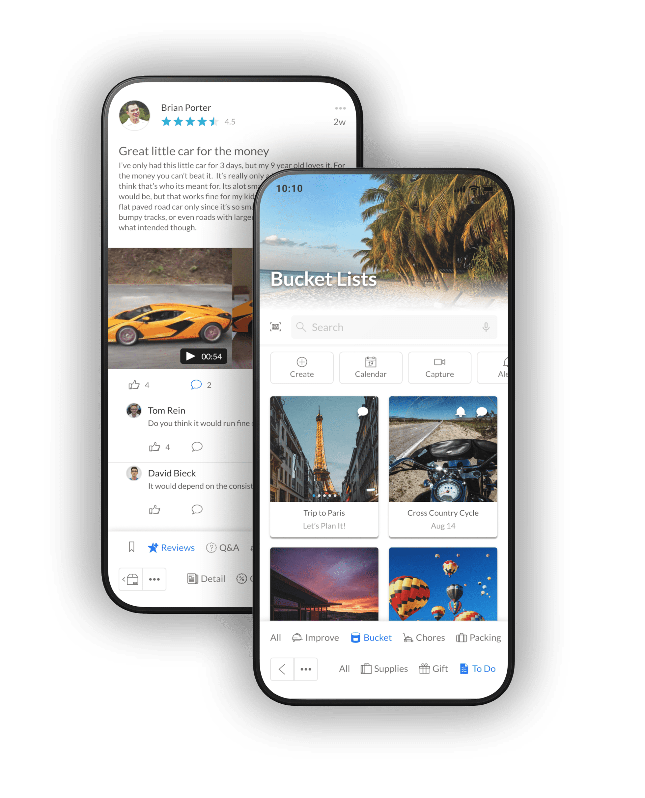

# ABLE

<figure><figcaption></figcaption></figure>

## Intro

As the breadth of solutions and interconnected experiences grows, it becomes increasingly important to maintain a consistent style to ensure an expected and uniform experience. The aim of ABLE is to accelerate the design and development of solutions in addition to reducing user confusion and extended on-boarding. To do this, we’ve built a design system to document and store reusable aspects while also sharing best practices for faster design and development.

### :book: Table of Contents

* [Structure](intro.md)
* [Themes](overview/)
* [Elements](core/overview/)
* [Components](core/components/)

### :handshake: How to Contribute

The main purpose of this repository is to evolve the core concept of scalable application design and development. We want to make contributing to this project as easy and transparent as possible. Read below to learn how you can take part in improving ABLE.

#### [Code of Conduct](contributing/code\_of\_conduct.md)

ABLE has adopted a Code of Conduct that we expect project contributors to abide by. Please read the code of conduct to understand what actions will and will not be allowed.

#### [Contributing Guide](contributing/)

Read this guide to learn about our development process, how to propose bug fixes and improvements, and how to build and test your changes.

#### Want to Help?

Want to report a bug, contribute some design or code work, or improve our documentation? Excellent we'd love for you to join us! Read up on our guidelines for [contributing](contributing/) and then check out one of our issues labeled as [good first issue](https://github.com/able-app/docs/issues?q=is%3Aissue+is%3Aopen+label%3A%22good+first+issue%22).

### :scroll: License

ABLE is MIT licensed, as found in the [LICENSE](LICENSE) file. ABLE's documentation is Creative Commons licensed.
