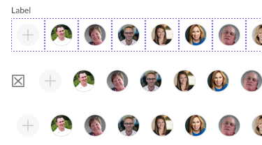

# UserList

Component: A form control for the collection of users (avatars), used when adding people in a form.

[Styleguide Link](https://zpl.io/29dz8PY)

* Parent: Form (Container)
* Child: [Label](../../overview/label.md), [Avatar - Bar](../../overview/avatar/avatar-bar.md), [FC - Leading](fc-leading.md), [FC - Trailing](fc-trailing.md)

## Properties

### Label

<figure><figcaption></figcaption></figure>

* **Top** - The label for the form field is placed above the form control.
* **Left** - The label for the form field is placed to the left of the form control.
* **None** - No label is used with the form control.

### Helper

The additional helper text that can be presented below the form control.

<figure><figcaption></figcaption></figure>

### Size

<figure><figcaption></figcaption></figure>

* Small - The default size for the control
* Medium
* Large

## Functionality

This form control acts as a container for a collection of people. People are added to the container (horizontal scroll of avatars) by tapping the placeholder (first) avatar to begin the selection process. That process will normally happen in a sheet that appears. Once the selection process is complete the user would close that sheet and those avatars that were selected would appear in the controls horizontal scroll.

**Note:** The structure and spacing of this component is the same between Textfield, Textarea, Selectlist, Chiplist, Slider, Userlist, and Toggle Button.

**Note:** Each of the nested elements and primitives of this form component have properties that can be adjusted to customize the component.

{% embed url="https://www.figma.com/proto/VN320MmRlLNR0UmdFula6N/Kitchen-Sink?node-id=2%3A24666&page-id=0%3A1&scaling=min-zoom&starting-point-node-id=2%3A24884&viewport=377%2C48%2C0.14" %}
