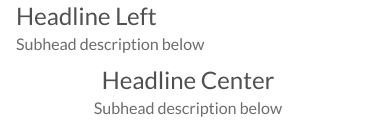

# Headline

Component: For use as a title of the screen or an article.

[Styleguide Link](https://zpl.io/a8DGR3K)

* Child: [Label](../overview/label.md)

## Properties

### Type

<figure><figcaption></figcaption></figure>

**Headline**: Just the title copy used at the top of body copy or as the title of a screen.

**Headline + Subtext**: The title copy along with supporting subtext below.

### Size

The relative size of the copy in relation to others within the collection.

<figure><figcaption></figcaption></figure>

* Huge (36dp)
* XLarge (30dp)
* Large (27dp)
* Medium (24dp)
* Small (21dp)
* XSmall (18dp)

### Alignment

<figure><figcaption></figcaption></figure>

How the copy is aligned within the screen, there are two options Left, and Center.

