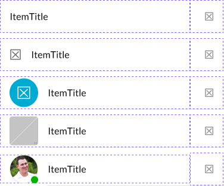

# ListItem

A single row (item) of a vertical index (list).

[Styleguide Link](https://app.zeplin.io/styleguide/6041aec8159a9b10c34d0182/components?cseid=608b00c8788d2a052f91e09b)

* Parent: [ListView](../../ks-modules/list-view.md)
* Children: [Icon](../../overview/icon.md), [Label](../../overview/label.md), [Avatar,](../../overview/avatar/) [Graphic](../../overview/graphic/), [AdaptIcon](../../overview/adapticon/)

## Properties

### Content

<figure><figcaption></figcaption></figure>

* **Single Line:** A single title
* **Two Line:** A title and subtext below
* **Two Line rating:** A title with ratings below
* **Three Line:** A title, secondary subtext below and a tertiary subtext below that

### Leading Style

Taken from the LIC - Leading convenience container the leading style allows us to change up the appearance of the area before (to the left of) the primary content.

<figure><figcaption></figcaption></figure>

* None
* Icon
* AdaptIcon
* Graphic
* Avatar

### Trailing Style

Supplied by the LIC - Trailing convenience container this provides us with the ability to alter the styling of the right side of the ListItem. This can be additional informational objects like an icon or text labels or controls like a checkbox, switch, button, input stepper, or a toggle to add input collection capabilities to the ListItem.

<figure><figcaption></figcaption></figure>

* None
* Icon
* Text (aka subtext right)
* Image
* AdaptIcon
* Avatar
* Button
* Checkbox
* Switch
* Input Stepper
* Toggle

**Note:** ListItems naturally form their own Bar (aka Row) where Cards and Graphics need an additional layer of organization at the Bar level. You can think of the ListItem as the equal to a Card or Graphic Bar.

### Functionality

ListItems can have multiple touch points the user can interact with.

1. **Primary Action:** When on its own, the primary action takes up the entire surface of the ListItem which is used as a hit area to either navigate or take an action related to the contents of the ListItem.
2. **Secondary Action:** When a secondary action is added to the primary action the ListItem is divided into two hit areas. The primary hit area takes up the majority of the space which is equal to the Leading and Primary content areas, and the secondary actions hit area covers the Trailing areas space. In the case of controls like checkboxes, switches, buttons, input steppers, and toggles these are the secondary hit areas themselves. In cases where there is an icon or text those can also act as hit areas to take action or navigate on the contents of the ListItem. Note that this hit area is no smaller than 56dp wide and the full height of the ListItem.
3. **Long Press:** Another option with ListItem interaction is the long press, which takes up the entire surface. A long press is considered anything over 1000ms on touch events and is equal to a right click in a web or desktop interface. Often a long press will result in the reveal of a menu/sheet/modal that displays a list of options for that ListItem.
4. **Swipe Right-to-Left:** Gestures are also a way of interacting with a ListItem. This action reveals hidden options that appear from behind the ListItem. These actionable options are those activities that are most often used with the ListItem. For example, in a mail application an often used action may be to delete the message, or archive it. For a desktop or web interface a click and drag could be used to accomplish the same functionality.
5. **Swipe Left-to-Right:** In the same way that a right-to-left gesture reveals additional actions, the left-to-right also does this same reveal of hidden options on the left side of the ListItem. An example of a good action here would be with a checklist where we want to quickly mark something as complete, a full swipe left-to-right would accomplish that activity.
