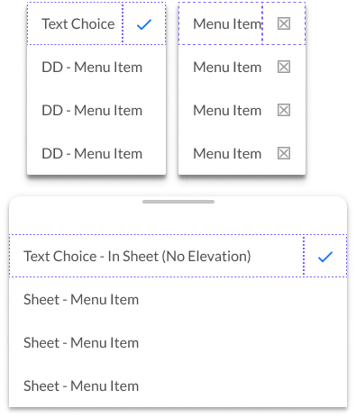

# Menu

Component: The display of a list of choices on a temporary surface (modal). The contents of this object are supplied from the Menu Container's (MC) primitives that separates the menu into three sections (left, primary, right).

[Styleguide Link](https://zpl.io/VkymMBg)

* Parent: [SelectList](../form/selectlist.md), [App Bar](../app-bar/), More Icons
* Child: [MC - Leading](mc-leading.md), [MC - Primary](mc-primary.md), [MC - Trailing](mc-trailing.md)

## Properties

### Type

<figure><figcaption></figcaption></figure>

* **Text** - The default menu display method with different possible configurations.
* **Icon** - A menu option with a leading icon to provide additional context to the option.
* **Avatar** - When presenting a list of users we use a leading avatar in addition to the users handle or name.
* **Graphic** - Used when we'd like to display a "Thing" in a menu.
* **AdaptIcon** - For those situations where we'd show categories of something or a place (ie. map location types).

### Configurations

<figure><figcaption></figcaption></figure>

* **Base** - The default configuration for each of the Types of menu.
* **Choice** - The ability to visually display the currently selected options within the menu. This functions as either a singular choice, or multi-choice.
* **Trailing Icon** - Visually provides another level of context to a menu option. For example, the status of the option being locked or unlocked by visually showing an unlocked,locked icon. A trailing icon can also display a chevron to indicate that there's another level to the menu options.

### Elevation

**On** - The menus that display over screen content, like with the press of the "More" icon to reveal actions or with the SelectList - Dropdown we show a shadow.

**Off** - For those menus that are contained within a parent like a container for a Sheet or the ScrollView of a screen we will not use a shadow.

Note: Take notice of the minor rounding of the corners on menus with elevation.
