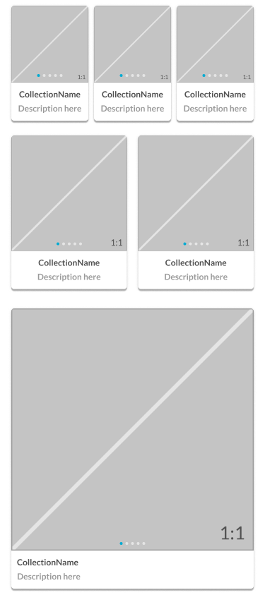

# CardBar

Collection: A convenience wrapper around CardItems for display in the bar component or as a row of stacked Bars in a CardView. See the [Bar - Structure](../../components/content-bar.md) documentation to learn more about what goes into a Bar.

[Styleguide Link](https://zpl.io/2yo0lZy)

* Parent: [CardView](./)
* Child: [CardItem](card-item.md)

## Properties

### Size

<figure><figcaption></figcaption></figure>

* Medium
* Large
* XLarge

### Scrollable

<figure><figcaption></figcaption></figure>

**On** - The horizontal listing of CardItems scroll off the right side of the screen and can be side-scrolled to reveal additional CardItems

**Off** - The width of the bar is locked to the width of the screen and additional CardItems would fall to the next CardBar below it.

### Caption

**On** - The wording below the Graphic is present

**Off** - No wording is displayed below the Graphic

