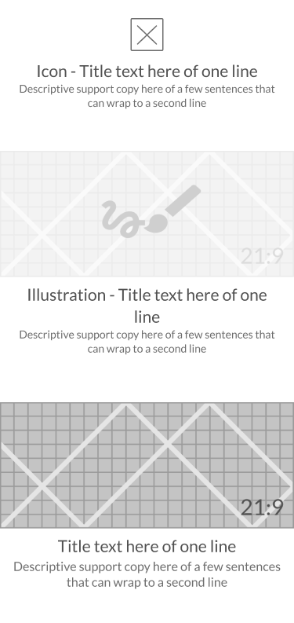

# Hero

Component: For use as the primary message on the screen. Hero messages attract attention and explain the task/activity to be preformed on the screen/during that step of a process.

[Styleguide Link](https://zpl.io/adKmZ35)

* Child: [Headline](../components/headline.md), [Icon](../overview/icon.md), [Illustration](../overview/graphic/illustration.md), [Graphic](../overview/graphic/)

## Properties

### Style

The visual styling of the hero in addition to the headline.

<figure><figcaption></figcaption></figure>

* Icon
* Illustration
* Image
