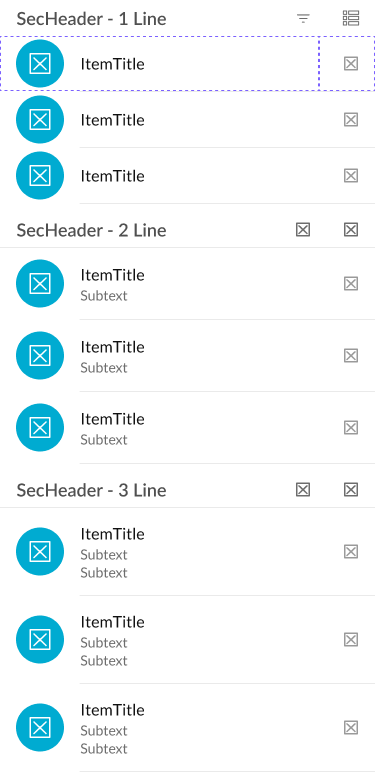

# ListView

A collection of multiple ListItems in a scrollable vertical index (list).

[Styleguide Link](https://zpl.io/adKWyRp)

* Parent: Screen
* Children: [ListItem](../components/list-item/), [Section Header](../components/sec-head.md)

## Properties

<figure><figcaption></figcaption></figure>

### Content

* **Single Line:** A single title
* **Two Line:** A title and subtext below
* **Three Line:** A title, secondary subtext below and a tertiary subtext below that

### Header

A header (aka SecHead) can exist at the top of a ListView and be used to separate list content into different collections under that header. That Section Header has a title and can have additional actionable icons associated with the section to take action on the collection.

## Functionality

The ListItems dynamically changes its width to fill the space based on the width of a portrait format screen. For the most part, the heights of ListItems is a fixed height and are stacked one on top of another down the screen in a single column for small form factor (phone) devices in portrait and landscape mode.

{% embed url="https://www.figma.com/proto/VN320MmRlLNR0UmdFula6N/Kitchen-Sink?node-id=2%3A24320&page-id=0%3A1&scaling=min-zoom&starting-point-node-id=2%3A24884&viewport=377%2C48%2C0.14" %}
