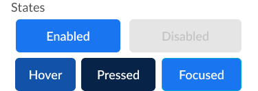

# ε Avatar

Element: Set sizes for display with or without a status badge. Avatars focus on a subject, using a simple background. They often represent a user or a brand, and are commonly used to represent a user/brand in messaging formats like sms and email.

[Styleguide Link](https://zpl.io/bey1LvW)

* Parent: [Avatar - Bar](avatar-bar.md), ListItem, Multiple others
* Child: [Badge](../badge/), [AvatarShape](avatar-shape.md)

## Properties

### Size & Shape

To account for multiple use cases the design system has established a set sizing standard for certain interface objects, with Avatar being one of those. The size and shape of an Avatar is set within the base level feeder of Avatar - Shape.

### Overlay

An avatar can have an overlay of a badge to show either the user/brands current status (online, offline, busy, etc.) or an AdaptIcon to represent an action (Add Photo, Edit) that could be taken on the Avatar, with a tap/click.

<figure><figcaption></figcaption></figure>

### State

The state of any nested object (ie. an element inside of a component) get's its state from the parent it is nested within. The state for an Avatar is normally dictated by its parent level container.

<figure><figcaption></figcaption></figure>

* Enabled
* Disabled
* Hover
* Pressed
* Focus

## Usage

**Avatar w/ Icon** - Used when there is no photo provided by the user. In the future we may want to randomize the background color to be one of the palette colors. The Icon is a Label element in Icon only format.

* Background-Color: N300
* Foreground-Color: N500
* Foreground-Src:account-circle-1.svg (foreground is the same width/height as the background)

**Avatar w/ Initials** - Label:Text "Users First Name, first initial + Last Name, first initial capitalized"

* Background-Color: N300
* Foreground-Color: N500
* Foreground-FontSize: XS:R4, S:R3, M:R1, L:H3, XL:H1 (Based on Avatar Size)

**Avatar w/ Accessory** - When we need to infer an action on an avatar, like Add Photo or Edit, we can use an accessory in the lower right corner of the Avatar to display an AdaptIcon with an Icon.

{% embed url="https://www.figma.com/proto/VN320MmRlLNR0UmdFula6N/Kitchen-Sink?node-id=2%3A23743&page-id=0%3A1&scaling=min-zoom&show-proto-sidebar=1&starting-point-node-id=2%3A24853&viewport=377%2C48%2C0.14" %}
