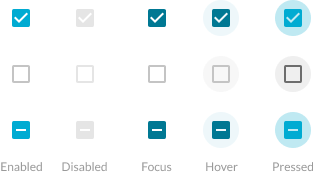

# Φ CheckboxCtrl

Primitive: A singular checkbox control with its possible styling, status (on/off) and states.

[Styleguide Link](https://zpl.io/aRnzW0p)

* Parent: [Checkbox](../../components/form/checkbox.md) (Form Component), Multiple others
* Child: [CheckboxShape](checkbox-shape.md)

### Properties

**Status** - The value given to the screen object, in this case a checkbox with possibilities of On, Off, Indeterminate.

<figure><figcaption></figcaption></figure>

**Style** - Supplied by the child level (Checkbox - Shape) this is the general appearance of the screen object. For now we have two styles, the normal appearance of the rounded corner checkbox which is the default, and a circular checkbox which is our customized appearance for a checkbox. Note: Additional appearance can be added to the Checkbox - Shape file to extend the styles at this level.

<figure><figcaption></figcaption></figure>

**State** - The different appearances of the screen object based on interaction and the status of the screen object. Possible states are Enabled, Disabled, Focus, Hover, Pressed.

<figure><figcaption></figcaption></figure>

### Interaction

**Hitarea** - It's important to understand that the tappable/clickable area of the screen object being displayed may be small in appearance than the actual area you can interact with. This hitarea will normally be based off of the parents container for this primitive.

{% embed url="https://www.figma.com/proto/VN320MmRlLNR0UmdFula6N/Kitchen-Sink?node-id=2%3A23569&page-id=0%3A1&scaling=min-zoom&show-proto-sidebar=1&starting-point-node-id=2%3A24853&viewport=377%2C48%2C0.14" %}
