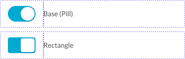

# Ω CheckboxShape

Base: The shape given to a checkbox and its status at the Primitive level.

[Styleguide Link](https://zpl.io/brAxME1)

Parent: [CheckboxCtrl](./)

To start with we will have two shapes available, the default normal [squared off checkbox](https://zpl.io/brAxME1) (that you see most of the time) and a customized appearance of "[Circle Check](https://zpl.io/anBGkKv)". These "Shapes" are set in the child level area of "Base - Shape" for the parent Checkbox Primitive.

<figure><figcaption></figcaption></figure>

The appearance of the shapes and status (checked, unchecked, indeterminate) are all supplied from an icon in the icon library (Icons-Base > Icons > Primatives). They are labeled in the icons file as Checkbox On/Off/Indeterminate for the squared off and Selection On/Off/Indeterminate for the circular checkbox.
