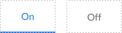

# Φ Tab

Primitive: A single tab used in a group in the tab bar component.

[Styleguide Link](https://zpl.io/VkyG35q)

* Parent: [Tab Bar](../../components/tab-bar.md)
* Child: [Tab - Active Indicator](tab-activeindicator.md)

## Properties

### Types

* **Icon:** A tab with the visual being an icon
* **Text:** A tab with a word(s)
* **Icon Top:** A text and icon tab with the icon being placed above the text description
* **Icon Left:** A text and icon tab with the icon being placed to the left of the text description
* **Text Scale:** The same as Text but with the ability of the Tab to scale its width based on the text content. This is used in tabs that horizontally scroll.
* **Icon Left Scale:** The same as Icon Left but with the ability of the Tab to scale its width based on the text content. This is used in tabs that horizontally scroll.

<figure><figcaption></figcaption></figure>

### Style

* Primary
* Secondary
* Dark
* Light

### Status

* **On:** The tab that has its contents being displayed.
* **Off:** The inactive tabs

<figure><figcaption></figcaption></figure>

### States

<figure><figcaption></figcaption></figure>

* Enabled
* Disabled
* Hover
* Pressed
* Focus

{% embed url="https://www.figma.com/proto/VN320MmRlLNR0UmdFula6N/Kitchen-Sink?node-id=2%3A24372&page-id=0%3A1&scaling=min-zoom&show-proto-sidebar=1&starting-point-node-id=2%3A24853&viewport=377%2C48%2C0.14" %}

