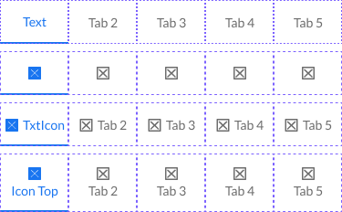

# ε ToggleCtrl

Element: The grouping of toggle button pieces that act together as a unit. This group is then treated as a single unit for dynamic resizing capabilities. Note, a single toggle control can exist on its own in a group. A toggle is also known as a Button Group in some frameworks.

[Styleguide Link](https://zpl.io/ag19AW0)

* Parent: [Toggle - Bar](toggle-bar.md), [App Bar Control - Pieces](../../components/app-bar/abc-pieces.md), [Toggle Button](../../components/form/togglebutton.md) (Form Component)
* Child: [TogglePieces](toggle-pieces.md)

## Properties

### Type

This is a pass-through of the two types (text, icon) from the toggle - pieces child level.

<figure><figcaption></figcaption></figure>

### Style

The different options for the stylings from the toggle-pieces are passed through to this layer since they act as a unit. Note, different styles can not be mixed within a toggle grouping.

<figure><figcaption></figcaption></figure>

* Primary
* Secondary
* Light
* Neutral
* Dark

### State

This is here primarily as a design convenience. All states for a toggle are set at the toggle-pieces layer and get passed up to their parent.

<figure><figcaption></figcaption></figure>

### Formats

**Multi:** The default type, used when there is more than a single toggle option. This type then has a "Choice" functionality depending on the intention of the grouping.

**Single:** In situations where we only need a single toggle on/off of a single button we use this option. An example of this in use could be with a mute button, where we'd want to display the status of "Muted" or "Unmuted" in an interface.

### Choice (Functional)

**Singular:** By default, the toggle button acts like a grouping of radio-buttons where only one option can be chosen. An example of a "singular" choice is a text editor list style where the list can be either bullet or numeric but not both at the same time.

**Multiple:** Setting the choice type to multiple allows multiple buttons to be selected (checkbox like) at the same time. An example of this choice "multiple" is a text editor with Bold, Italic, Underline options where multiple can be on/off at the same time.

***

**Possible Future Consideration**

### Orientation

**Horizontal:** By default, toggle buttons display horizontally across the screen and adjust their widths to the size of its parent container.

**Vertical:** In the vertical orientation text and icons continue to display upright, and the toggle buttons are just stacked vertically one on top of the next.

{% embed url="https://www.figma.com/proto/VN320MmRlLNR0UmdFula6N/Kitchen-Sink?node-id=2%3A23803&page-id=0%3A1&scaling=min-zoom&show-proto-sidebar=1&starting-point-node-id=2%3A24853&viewport=377%2C48%2C0.14" %}
