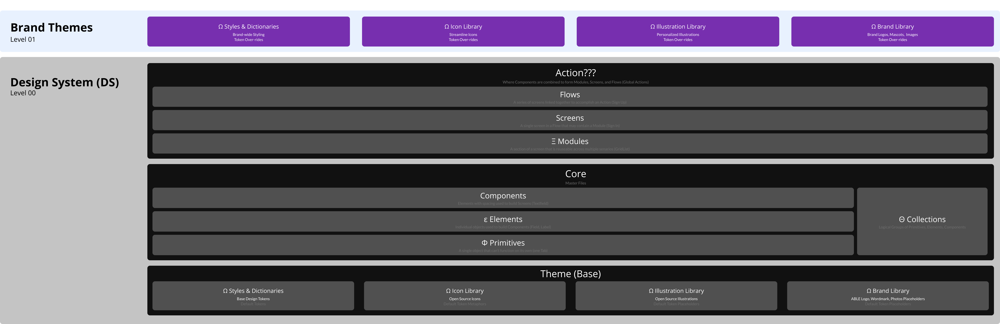

# systems

The design system is made up of multiple “UI Kits” aka files, that collectively make up a multi-tiered design system. This is often referred to as the "System of Systems". Best practices built into our design tools allow the use of shared design libraries, with role based access control. These files and asset libraries along with the [atomic design principles](https://bradfrost.com/blog/post/atomic-web-design/), are at the core of the design system.

For example, managing icons in a different file than the components, separated from a data visualization module that inherits colors from a brand theme.

This compartmentalizes the features and functionality of the design system, allowing for easier updates \(Ex. Swapping out all icons for a different style as tastes change\), and governance to keep things consistent at a high level.

### Kit Structure

**The diagram above is covered in greater detail below**

# Level 00 - Design System

The Design System \(DS\) acts as the foundation of everything we build. These core kits, aka "files" are shared with the other levels in a cascading format. Meaning that objects and tokens at a higher level can over-ride those below them. These reusable pieces of the design system follow an atomic design architecture which is mirrored at each level. We break that atomic structure into the following layers, starting with the most basic of things, the base layer.

## Ω Base Layer (Particles)

Base layer kits contains the lowest level objects of the “atomic design” system that make up a theme. Notice the greek symbols are used throughout the design system to denote which layer an object falls into in our naming convention. Here are the base layer styles, dictionaries and libraries:

* Styles & Dictionaries
  * Color Styles
  * Text Styles
  * Effect Styles 
  * Spacing Dictionary
  * Size Dictionary
  * Time Dictionary
  * Interaction Dictionary
  * Motion Dictionary
  * Audio Dictionary
  * Haptic Dictionary
* Icon Library
* Illustration Library
* Brand Library

_Note: As the design system expands we will add new kits to a theme, for example an animations library._

#### Style Dictionary

From the developers point of view a theme and all of these libraries and color palettes are built as "style dictionaries" and referenced in their code. [Style Dictionary](https://amzn.github.io/style-dictionary/#/) is a build system that allows us to define styles and assets once, in a way for any platform or language to consume. This is a simple JSON file championed by the talented designer/developers over at Amazon. Read more about Style Dictionary in their [GitHub documentation](https://amzn.github.io/style-dictionary/#/).

#### Libraries

We refer to assets that primarily exist as external files as libraries. There are multiple libraries that we will pull assets from.

* Iconography
* Illustration
* Animation
* Audio

By establishing libraries we can swap out one library for another easily. For example, let's say at Christmas time we want to have customized Illustrations to reflect the season. Simply swap the reference to the "Illustrations - Thanksgiving" library for the "Illustrations - Christmas" library and it's ready to go. Another byproduct of this is that it provides a compartmentalized work area for the Illustrator to work and store like objects, that carries a consistent structure.

**Design Tokens**

Design Tokens are key-value pairs that represent the specs of the design system. They are the atomic, reusable building blocks of a design system, such as colors, typography, spacing, motion, and even sounds and haptic feedback. In code these are referred to as constants.

In design systems, tokens are used in place of hard-coded values of visual primitives to ensure flexibility and cohesiveness across all products.

Design tokens allow teams to better collaborate and ensure brand consistency across multiple products, platforms, and media. A theme is a collection of tokens, each with a defined role. For example, a token for a color may be \#primary and is used in all instances that a primary color is used. For colors the token simply stores the RGBA value. For typography tokens work the same way, assigning type styles based on the token role. For example, H1 is used for prominent typography like headlines. Type tokens store the full range of type settings including: font-size, line-height, letter-spacing, as well as breakpoint sizing changes.

**Semantic Token Aliases**

Token aliases let you relate a semantic token to a base "primitive" token for a specific context to get a level of abstraction. This helps us communicate the intended purpose of a token, independent of the actual/primitive value of the token.

Think of semantic tokens as design decisions on style primitives.

As an example of this, when creating a semantic tokens for the light and dark modes of a theme we have primitive color style tokens for "White" and "Black" that store the actual color values and that's the same for all themes. On a second level, the semantic level, we have tokens for "Background Color" and "Text Color". In the light mode, the Background Color semantic token is defined as an alias of White, and Text Color's semantic token is an alias of the Black primitive token.

For the dark mode of the theme, instead of changing the actual values of our primitive tokens \(the Black & White tokens\), we'd edit our semantic tokens and switch the aliased tokens.

To learn more about semantic tokens, this is a good series of articles. [https://dev.to/ynab/a-semantic-color-system-the-theory-hk7](https://dev.to/ynab/a-semantic-color-system-the-theory-hk7)

## Themes

Themes are the containers for all of our "Base Layer" objects. This provides the ability to stylize color, sizes, surfaces, interactions and effects that can be used across a single product, multiple products, or across the entire brand. Themes keep things consistent with the style "form" of an object, while the intent "function" is handled in other kits. Themes are valuable when we work with multiple products \(apps\) that may have slightly different stylings. An example of this being the difference between the on-demand drivers app and the customers apps. Both have Sign-In screens and each have the same intent for a Call-to-Action (CTA) button, but the styling may change from a primary color of blue with the driver CTA button to a primary color of green for the customer CTA button.

So in Level 00 we establish the default styles, in a Base "Theme" and at Level 01 & 02, over-ride those with our brand and product specific "Theme" choices. This allows us to decouple all branding choices from the core design objects and their intent, while still providing the ability to customize styling with themes.

## Core

The next layer up in the Design System is our "Core" file containing Primitives, Elements, Components and Collections of these. Elements and Components are the equivalent to Atoms and Molecules in the [Atomic Design](https://bradfrost.com/blog/post/atomic-web-design/) structure. _Note, we've added our own lower level of "Particles" and other segmentations like "Primitives" and "Collections" to add a much needed layers to the Atomic Design structure when speaking to the way we structure the design system._

#### **Φ** Primitives

At both the Element and Component level we have the need to separate out parts of the object \(Element or Component\) into even more simplistic objects before combining them as an element or component. Primitives are how we classify these simple objects. A good example of a "Primitive" is a single Tab, which doesn't serve much of a purpose on it's own, but when combined with other tabs, in an "Element" it is able to realize its purpose.

#### **ε** Elements

The individual or combined (ie. Tab) primitive interface building block(s)Tex used to build components in the design system. These objects typically don't have much use on their own, but when combined with other elements to form a component serve a defined purpose. Elements do not have any spacial spacing characterists outside of its own borders, meaning its spacing to other objects on the screen, those are applied at the Component level. Elements are never used to build screens, they are strictly used to build Components, which are then used to build screens. A few of the more common elements are:

* Checkbox
* Radio Button
* Switch
* Slider
* Label

#### Θ Collections

From time to time, to keep things logically organized in the design system we use a Collection.  All this is, is a container for us to keep like items together. Know that a Collection can consist of Primitives, Elements and even Components.  It's use strictly for organization purposes.  A good example of how this is used in the design system is in how we structure a ListItem into Leading, Primary, and Trailing Collections that display in the same relative location in the ListItem but serve different purposes. In the design this provides for a single Component called ListItem, that has hundreds of variations based on the choices for Leading, Primary and Trailing.

#### **Components**

**A component is an interface object built out of elements or by nesting other components, with a background surface and spacing, to serve as a reusable object in building interfaces.** They’re the Lego pieces we stack together in a ScrollView to design experiences that are consistent. Note that Components do not carry a Greek character. Components provide focus to the screen designer by solving user needs when designing screens. This is the concept of an abstract component, where the focus is on the intent, as opposed to the interface. Think of an abstract component as the skeleton. And the manifestation at each breakpoint \(phone, tablet, desktop, web, etc.\), as the skin of the component handled by the Theme. A few of the more common components are:

* AppBar
* TabBar
* Headline
* ListItem
* GridView
* TextField

Components dynamically scale horizontally to fill the width of the screen, but in 99% of cases DO NOT scale in height. All components are designed to stack vertically on top of one another, with no vertical spacing between them, in a ScrollView.  The ABLE Design Systems definition of a Component goes beyond those that you typically see in other frameworks like Bootstrap, Angular or Ionic which for the majority of screen objects, all stop at the Element level under our definition of an Element.

App

#### **Ξ Modules**

Relatively complex groupings of components, with a specific purpose, are generally considered to be modules. A GridView (listing of graphics in a grid) or a navigation drawer would be considered a module. Modules can also be thought of as self-contained single purpose design objects.

#### **Screens**

This is where Modules and Components from Core are combined to form a screen design at each of our breakpoints \(phone, tablet, web/desktop\). A few common modules and patterns are:

* Sign-In
* Profile
* User-ListView
* Object-ListView
* Image-GridView

#### **Flows**

# Level 01 - Brand Kits

In the Brand level we use over-rides to alter the default design system Theme, Libraries, Palettes, and any other design system files to fit the styling of the brand. This brand level can have further over-rides at the product level for those changes between the different products, but the majority of the branding is done at this level.

#### Over-rides

Anything that exists at the design system layer can have an over-ride applied. The reasoning for having brand over-rides is to provide a mechanism for modular testing and granular change between segments of the audience. For example, let's say we're launching a product in a new city \(New York City\) and we'd like to swap out our city specific photos and illustrations. Those city specific libraries can be created and programmatically swapped out. Another scenario could be for testing out font changes for readability within a warehouse, swapping one file for another for a test group while keeping others on the main theme is a breeze.

# Level 02 - Product Kits

These kits are for specific products \(app, software, site, design etc.\) that we’re building. In here, we’ll store product-specific templates, patterns, modules, basically any customizations of level 00 design system layers, or level 01 branding. This keeps our design system focused on core concept and all customizations at a brand or product level.

### Other Products

We won’t go into level 02 kits outside of applications here. However, planning for future marketing kits for print and web pieces will help govern brand stylings between business groups \(Ex. Marketing\) within the organization.

