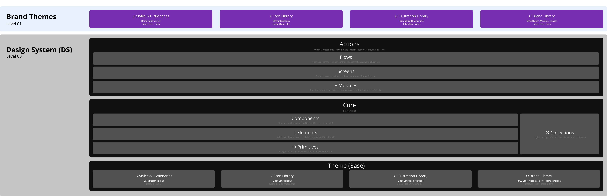

# Structure

## Design - UI Kits

The design system is made up of multiple “UI Kits” aka Figma files, that collectively make up a multi-tiered design system. This is often referred to as the "System of Systems". Best practices built into our design tools allow the use of shared design libraries, with role based access control. These files and asset libraries along with the [atomic design principles](https://bradfrost.com/blog/post/atomic-web-design/), are at the core of the design system.

For example, managing icons in a different file than the components, separated from a data visualization module that inherits colors from a brand theme is just good practice. This compartmentalizes the features and functionality of the design system, allowing for easier updates (Ex. Swapping out all icons for a different style as tastes change), and governance to keep things consistent at a high level.

#### Kit Structure

### Naming Convention

You'll notice throughout the design system that we've used greek characters at the start of some collections and file names.  This is our shorthand method to give a sense of which layer of the design system an object exists, within the name of the file or folder.  These characters have been chosen so that when files and folders are ordered alphabetically they fall in order from our base layers at the bottom, on up. Here's a quick run down of the characters used...

**Ω Base** - The lowest layer of an object, often consisting of a value or shape. (Ex. Primary Color)

**Θ Collection** - An organization method to keep like items grouped together. (Ex. ListItem - Leading)

**Φ Primitive** - A single object that when paired with other same primitives become an element or component. (Ex. Single Tab)

**ε Element** - The individual or combined primitive building block(s) used in components. (Ex. Label)

**Component** - Built out of elements or nesting other components, with a background surface and spacing, to serve as a reusable object in building Modules & Screens. (Ex. ListItem)

**Ξ Module** - Relatively complex groupings of components, with a specific purpose. (Ex. ListView)

**Screen** - Where our Components and Modules come together. (Ex. Sign In)

**Flow** - A series of Screens tied together to fulfill a purpose, a complete Action. (Ex. Sign Up)fig

{% embed url="https://www.figma.com/proto/VN320MmRlLNR0UmdFula6N/Kitchen-Sink?node-id=272%3A164381&page-id=0%3A1&scaling=min-zoom&starting-point-node-id=2%3A24853&viewport=377%2C48%2C0.19" %}

## Level 00 - Design System

The Design System (DS) acts as the foundation of everything we build. These core kits, aka "files" are shared with the other levels in a cascading format. Meaning that objects and tokens at a higher level can over-ride those below them. These reusable pieces of the design system follow an atomic design architecture which is mirrored at each level. We break that atomic structure into the following layers, starting with the most basic of things, the base layer.

### Themes

Themes are the containers for all of our "Base Layer" objects, which are divided into multiple kits: Styles & Dictionaries, Icon, Illustration, Brand Libraries. This provides the ability to stylize color, sizes, surfaces, interactions and effects that can be used across a single product, multiple products, or across the entire brand. Themes keep things consistent with the style "form" of an object, while the intent "function" is handled in other kits. Themes are valuable when we work with multiple products (apps) that have different stylings. An example of this being the difference between the on-demand drivers app and the customers apps. Both could use the same Sign-In Module and each have the same intent for a Call-to-Action (CTA) button, but the styling may change from a primary color of blue with the driver CTA button, to a primary color of green for the customer CTA button.

So in Level 00 we have our default styles, in a "Base" theme and at Level 01 & 02, over-ride those with the brand and product specific theme choices a client would have. This allows us to decouple all branding/theming choices as we build in the Core Kit.

### Core

The next layer up in the Design System is our "Core" kit containing Primitives, Elements, Components and Collections of these. Elements and Components are the equivalent to Atoms and Molecules in the [Atomic Design](https://bradfrost.com/blog/post/atomic-web-design/) structure. _Note, we've added our own lower level of "Particles" and other segmentations like "Primitives" and "Collections" to add much needed layers to the Atomic Design structure when speaking to the way we actually need to organize things in the design system._

### Actions

The next layer up in the Design System is our "Actions" kit containing Modules, Screens, Flows and Collections of these that can be assembled into a self contained app Extension. When referring back to the [Atomic Design](https://bradfrost.com/blog/post/atomic-web-design/) principles these equate to "Organisms", "Templates", and "Pages". This is where we start to build out the functionality of the actionable activities that a user will do within the application. For example, most applications have a Sign Up process that have a series of Screens (Name & Pass > Recovery Email > Choose Username... ) in a Flow. Where one of those screens, or parts of the screen could be the Module for turning on FaceID.&#x20;

## Level 01 - Brand Kits

In the Brand level we use over-rides to alter the default design system Theme, Libraries, Styles & Dictionaries, to fit the styling of the brand. This brand level can have further over-rides at the product level for those changes between the different products, but the majority of the branding is done at this level.

**Over-rides**

Anything that exists at the design system layer can have an over-ride applied. The reasoning for having brand over-rides is to provide a mechanism for modular testing and granular change between segments of the audience. For example, let's say we're launching a product in a new city (New York City) and we'd like to swap out our city specific photos and illustrations. Those city specific libraries can be created and programmatically swapped out. Another scenario could be for testing out font changes for readability within a warehouse, swapping one file for another for a test group while keeping others on the main theme is a breeze.

